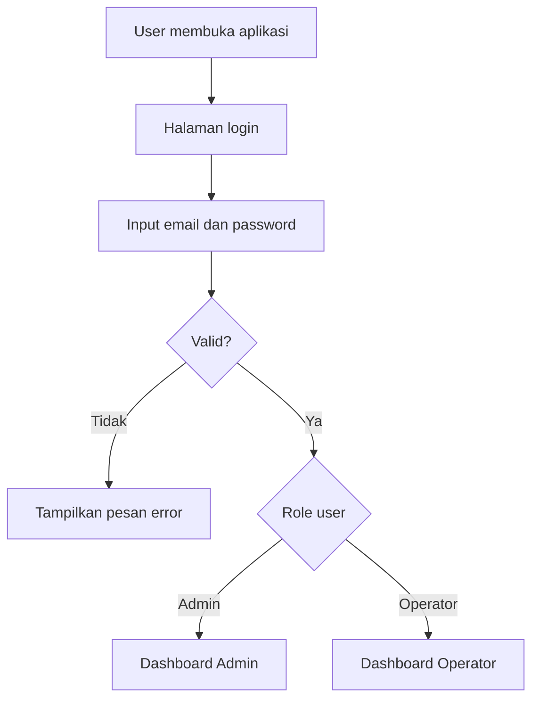
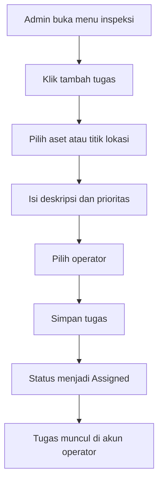
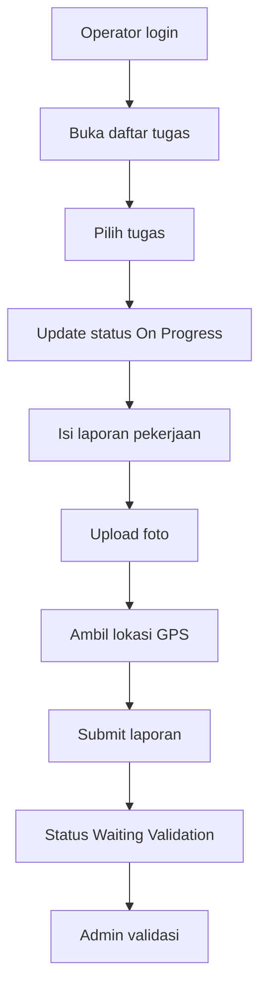
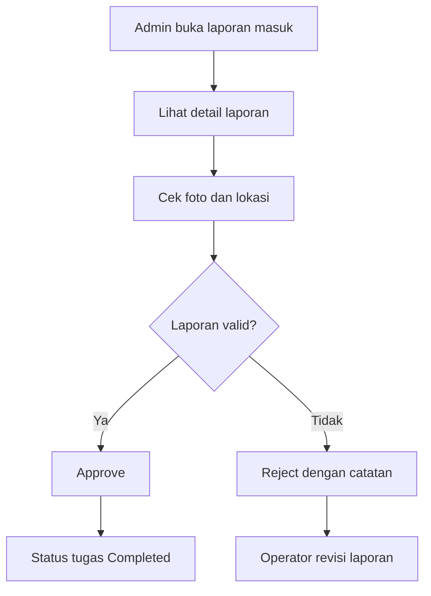
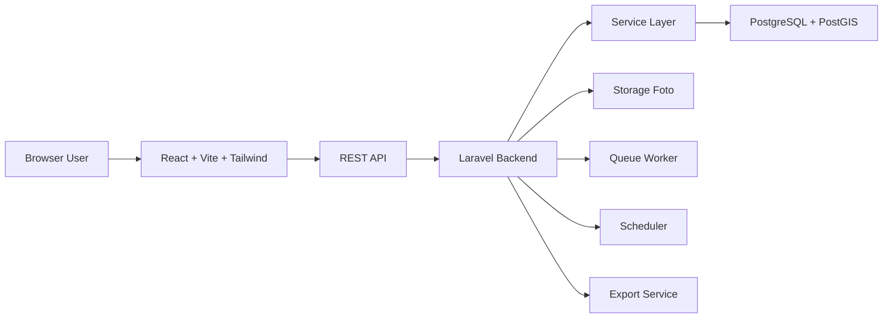

# PRD.md

# Infranexia FiberOps

## Sistem Informasi Geospasial Aset, Gangguan, dan Operasional Jaringan Fiber Optik

**Versi:** 1.1  
**Status:** Draft Rancang Bangun  
**Target pengguna:** Admin dan Operator Lapangan  
**Platform:** Web responsive  
**Backend utama:** Laravel API  
**Frontend:** React, Vite, Tailwind CSS  
**Database:** PostgreSQL + PostGIS  
**Konteks:** Operasional jaringan fiber optik, monitoring aset, gangguan, inspeksi, dan laporan lapangan

---

## 1. Ringkasan Produk

Infranexia FiberOps adalah web app untuk membantu monitoring aset jaringan fiber optik, gangguan layanan, inspeksi lapangan, dan laporan operator berbasis peta. Sistem ini menggabungkan dashboard operasional, peta geospasial, analisis temporal, risk priority, dan pelaporan pekerjaan dalam satu aplikasi.

Aplikasi ini dibuat untuk mengurangi pencatatan manual, mempercepat validasi laporan, dan membantu admin melihat kondisi lapangan secara cepat.

Fokus MVP hanya memakai dua role:

1. **Admin**
2. **Operator Lapangan**

---

## 2. Tujuan Produk

Membangun sistem informasi operasional jaringan fiber optik berbasis web untuk monitoring aset, gangguan, inspeksi, dan laporan lapangan secara terstruktur.

### Tujuan Khusus

- Menyediakan dashboard ringkas untuk admin.
- Menampilkan aset dan gangguan dalam peta interaktif.
- Memudahkan operator membuat laporan pekerjaan dari lapangan.
- Menyediakan analisis tren gangguan berdasarkan waktu.
- Menghasilkan prioritas penanganan berdasarkan risk score sederhana.
- Menyimpan dokumentasi foto dan lokasi secara terpusat.
- Mendukung ekspor laporan untuk kebutuhan evaluasi.

---

## 3. Nama dan Konsep Aplikasi

**Nama:** Infranexia FiberOps  
**Kepanjangan konsep:** Infranexia Fiber Operations Monitoring System  
**Tagline:** Monitoring aset, gangguan, dan pekerjaan lapangan berbasis peta.

---

## 4. Scope MVP

### Fitur Masuk MVP

1. Login dan manajemen role.
2. Dashboard overview operasional.
3. Peta monitoring aset, gangguan, dan inspeksi lapangan.
4. Master data aset jaringan.
5. Input laporan operator lapangan.
6. Manajemen gangguan jaringan.
7. Manajemen pekerjaan inspeksi lapangan.
8. Analisis temporal gangguan dan laporan.
9. Risk and priority penanganan.
10. Ekspor laporan CSV atau Excel.
11. Upload foto dokumentasi.
12. Audit log aktivitas penting.

### Fitur Tidak Masuk MVP

1. Mobile app native.
2. Integrasi langsung dengan sistem internal perusahaan.
3. Notifikasi WhatsApp otomatis.
4. Machine learning kompleks.
5. OCR otomatis dari foto aset.
6. Mode offline penuh.

---

## 5. Role Pengguna

## 5.1 Admin

Admin mengelola data, memantau dashboard, memvalidasi laporan, dan membuat prioritas penanganan.

### Hak Akses Admin

- Melihat semua dashboard.
- Mengelola data aset.
- Mengelola data gangguan.
- Mengelola pekerjaan inspeksi lapangan.
- Melihat semua laporan operator.
- Memvalidasi laporan.
- Mengubah status pekerjaan.
- Melihat risk priority.
- Mengekspor laporan.
- Mengelola akun operator.

## 5.2 Operator Lapangan

Operator menginput laporan pekerjaan, dokumentasi, status pengerjaan, dan lokasi.

### Hak Akses Operator

- Melihat daftar tugas yang ditugaskan.
- Melihat peta lokasi pekerjaan.
- Membuat laporan lapangan.
- Upload foto dokumentasi.
- Mengubah status tugas miliknya.
- Melihat riwayat laporan sendiri.

---

## 6. Modul Utama Aplikasi

## 6.1 Dashboard Overview

### Komponen

- Total aset aktif.
- Total gangguan bulan ini.
- Total inspeksi lapangan.
- Total laporan menunggu validasi.
- Grafik tren gangguan.
- Grafik status pekerjaan.
- Tabel pekerjaan terbaru.
- Tabel gangguan terbaru.

## 6.2 Map Monitoring

### Fitur

- Peta interaktif.
- Marker aset jaringan.
- Marker gangguan.
- Marker inspeksi lapangan.
- Filter wilayah.
- Filter status.
- Filter jenis aset.
- Filter tingkat risiko.
- Detail marker dalam drawer atau modal.
- Tombol buat laporan dari titik lokasi.

### Layer Peta

1. Layer Aset
2. Layer Gangguan
3. Layer Inspeksi
4. Layer Risiko

## 6.3 Master Data Aset

### Contoh Aset

- ODP
- ODC
- Tiang
- Kabel feeder
- Kabel distribusi
- Closure
- STO

### Field Data Aset

| Field | Tipe | Keterangan |
|---|---|---|
| asset_code | string | Kode unik aset |
| asset_name | string | Nama aset |
| asset_type | enum | Jenis aset |
| region | string | Wilayah |
| latitude | decimal | Koordinat lintang |
| longitude | decimal | Koordinat bujur |
| address | text | Alamat |
| status | enum | Aktif, monitoring, rusak, nonaktif |
| installation_date | date | Tanggal pemasangan |
| notes | text | Catatan tambahan |

## 6.4 Manajemen Gangguan

### Jenis Gangguan

- Kabel putus.
- Redaman tinggi.
- ODP rusak.
- ODC bermasalah.
- Gangguan perangkat.
- Gangguan lingkungan.
- Gangguan lain.

### Status Gangguan

- Open
- On Progress
- Waiting Validation
- Resolved
- Closed

## 6.5 Manajemen Inspeksi Lapangan

Modul ini digunakan untuk mengelola pekerjaan inspeksi aset, validasi kondisi jaringan, pengecekan lokasi, dan tindak lanjut gangguan.

### Status Pekerjaan

- Draft
- Assigned
- On Progress
- Waiting Validation
- Completed
- Rejected

### Fitur Admin

- Membuat tugas inspeksi.
- Menugaskan operator.
- Menentukan lokasi pekerjaan.
- Menentukan deadline.
- Mengatur prioritas.
- Melihat progres.
- Memvalidasi laporan hasil.

### Fitur Operator

- Melihat tugas.
- Mengubah status menjadi on progress.
- Mengisi hasil pekerjaan.
- Upload foto kondisi aset atau lokasi.
- Mengirim lokasi aktual.
- Submit laporan untuk validasi.

## 6.6 Laporan Lapangan

### Field Laporan

| Field | Tipe | Keterangan |
|---|---|---|
| report_code | string | Kode laporan |
| task_id | foreign key | Tugas terkait |
| asset_id | foreign key | Aset terkait |
| operator_id | foreign key | Pelapor |
| report_date | datetime | Waktu laporan |
| latitude | decimal | Lokasi aktual |
| longitude | decimal | Lokasi aktual |
| condition_before | text | Kondisi awal |
| action_taken | text | Tindakan |
| condition_after | text | Kondisi akhir |
| status | enum | Draft, submitted, approved, rejected |
| notes | text | Catatan |

## 6.7 Analisis Temporal

### Analisis yang Ditampilkan

- Tren gangguan harian.
- Tren gangguan mingguan.
- Tren gangguan bulanan.
- Tren inspeksi per wilayah.
- Perbandingan open dan closed issue.
- Rata-rata durasi penyelesaian.
- Peak time gangguan.
- Volume laporan operator per minggu.

## 6.8 Risk and Priority

### Komponen Skor Risiko

| Komponen | Bobot | Keterangan |
|---|---:|---|
| Severity gangguan | 30% | Dampak gangguan |
| Frekuensi gangguan | 25% | Jumlah gangguan historis |
| Criticality aset | 20% | Peran aset terhadap jaringan |
| Kedekatan dengan pelanggan terdampak | 15% | Estimasi dampak layanan |
| Usia aset atau waktu inspeksi terakhir | 10% | Kondisi historis aset |

### Rumus Sederhana

```text
risk_score = (severity * 0.30) + (frequency * 0.25) + (asset_criticality * 0.20) + (impact_distance * 0.15) + (asset_age * 0.10)
priority_score = risk_score * 20
```

### Kategori Prioritas

| Score | Kategori | Tindakan |
|---:|---|---|
| 0 sampai 39 | Rendah | Monitoring rutin |
| 40 sampai 69 | Sedang | Jadwalkan inspeksi |
| 70 sampai 84 | Tinggi | Prioritaskan penanganan |
| 85 sampai 100 | Kritis | Tindak segera |

---

## 7. Alur Sistem

## 7.1 Alur Login



## 7.2 Alur Admin Membuat Tugas Inspeksi



## 7.3 Alur Operator Mengirim Laporan



## 7.4 Alur Validasi Admin



---

## 8. Alur Tech Stack

## 8.1 Arsitektur Umum



## 8.2 Frontend

| Komponen | Teknologi | Fungsi |
|---|---|---|
| UI app | React + Vite | Frontend SPA |
| Styling | Tailwind CSS | Design system |
| Routing | React Router | Navigasi halaman |
| State | Zustand atau TanStack Query | State dan server cache |
| Chart | ApexCharts atau Recharts | Grafik dashboard |
| Map | Leaflet atau Mapbox GL | Peta interaktif |
| Form | React Hook Form | Input form |
| Validation | Zod | Validasi frontend |
| Icon | Lucide React | Ikon UI |

## 8.3 Backend

| Komponen | Teknologi | Fungsi |
|---|---|---|
| Framework | Laravel | REST API dan business logic |
| Auth | Laravel Sanctum | Token atau SPA authentication |
| Database ORM | Eloquent | Query database |
| Validation | Form Request | Validasi request |
| File upload | Laravel Storage | Simpan foto laporan |
| Queue | Laravel Queue | Proses export dan notifikasi |
| Scheduler | Laravel Scheduler | Rekap otomatis |
| Export | Laravel Excel | Export CSV dan Excel |
| Logging | Activity Log | Audit aktivitas |

## 8.4 Database

| Komponen | Teknologi | Fungsi |
|---|---|---|
| Database utama | PostgreSQL | Penyimpanan data utama |
| GIS extension | PostGIS | Query lokasi dan geospasial |
| Cache | Redis | Cache dashboard dan queue |
| Backup | pg_dump | Backup berkala |

## 8.5 Deployment

| Komponen | Rekomendasi |
|---|---|
| Web server | Nginx |
| Runtime backend | PHP-FPM |
| Process manager | Supervisor |
| Database server | PostgreSQL |
| Storage | Local storage atau S3 compatible |
| CI/CD | GitHub Actions |
| Container | Docker untuk development |

---

## 9. Struktur Menu

## 9.1 Menu Admin

1. Dashboard
2. Map Monitoring
3. Aset Jaringan
4. Gangguan
5. Inspeksi Lapangan
6. Laporan Lapangan
7. Analisis Temporal
8. Risk and Priority
9. Export Report
10. User Management
11. Settings

## 9.2 Menu Operator

1. Dashboard Operator
2. Tugas Saya
3. Map Lokasi
4. Buat Laporan
5. Riwayat Laporan
6. Profil

---

## 10. Desain UI

## 10.1 Gaya Visual

Aplikasi memakai gaya **Monochromatic Blue** dengan karakter profesional, bersih, dan cocok untuk sistem internal perusahaan.

### Prinsip UI

- Sidebar gelap memakai Navy.
- Konten utama memakai background Slate 50.
- Card memakai putih.
- Primary action memakai Brand 600.
- Grafik memakai Brand dan warna status.
- Map memakai marker status yang kontras.
- Layout harus rapi dan mudah dibaca.

## 10.2 Font

```css
font-family: 'Plus Jakarta Sans', sans-serif;
```

### Skala Font

| Elemen | Ukuran | Weight |
|---|---:|---:|
| Page title | 24px sampai 28px | 700 |
| Section title | 18px sampai 20px | 700 |
| Card title | 14px sampai 16px | 600 |
| Body text | 14px | 400 sampai 500 |
| Caption | 12px | 400 |
| Table text | 13px sampai 14px | 400 |

---

## 11. Design System Color Palette

## 11.1 Slate

| Token | HEX | Penggunaan |
|---|---|---|
| slate-50 | `#f8fafc` | Background utama |
| slate-100 | `#f1f5f9` | Section background |
| slate-200 | `#e2e8f0` | Border ringan |
| slate-300 | `#cbd5e1` | Border aktif |
| slate-400 | `#94a3b8` | Placeholder |
| slate-500 | `#64748b` | Text secondary |
| slate-600 | `#475569` | Text body |
| slate-700 | `#334155` | Text heading kecil |
| slate-800 | `#1e293b` | Heading |
| slate-900 | `#0f172a` | Text utama |

## 11.2 Brand

| Token | HEX | Penggunaan |
|---|---|---|
| brand-50 | `#eff6ff` | Primary soft background |
| brand-100 | `#dbeafe` | Hover soft |
| brand-200 | `#bfdbfe` | Border primary soft |
| brand-300 | `#93c5fd` | Chart light |
| brand-400 | `#60a5fa` | Chart medium |
| brand-500 | `#3b82f6` | Primary icon |
| brand-600 | `#2563eb` | Primary button |
| brand-700 | `#1d4ed8` | Primary hover |
| brand-800 | `#1e40af` | Active state |
| brand-900 | `#1e3a8a` | Strong primary |

## 11.3 Navy

| Token | HEX | Penggunaan |
|---|---|---|
| navy-50 | `#eaf1f9` | Navy soft background |
| navy-100 | `#d5e3f3` | Soft indicator |
| navy-200 | `#abcdde` | Border navy light |
| navy-300 | `#82b7c9` | Accent light |
| navy-400 | `#58a0b4` | Accent medium |
| navy-500 | `#234a7d` | Secondary brand |
| navy-600 | `#1b3b64` | Sidebar hover |
| navy-700 | `#15325b` | Sidebar active |
| navy-800 | `#0f2442` | Sidebar surface |
| navy-900 | `#0A1D37` | Sidebar base |
| navy-950 | `#050f1d` | Deep contrast |

## 11.4 Semantic Colors

| Token | HEX | Penggunaan |
|---|---|---|
| success | `#10b981` | Selesai, normal, approved |
| warning | `#f59e0b` | Perlu perhatian |
| danger | `#ef4444` | Risiko tinggi, rejected |
| info | `#3b82f6` | Informasi dan monitoring |
| purple | `#8b5cf6` | Analitik tambahan |

---

## 12. Tailwind Config

```js
// tailwind.config.js
export default {
  content: [
    './index.html',
    './src/**/*.{js,jsx,ts,tsx}',
  ],
  theme: {
    extend: {
      fontFamily: {
        sans: ['Plus Jakarta Sans', 'sans-serif'],
      },
      colors: {
        slate: {
          50: '#f8fafc',
          100: '#f1f5f9',
          200: '#e2e8f0',
          300: '#cbd5e1',
          400: '#94a3b8',
          500: '#64748b',
          600: '#475569',
          700: '#334155',
          800: '#1e293b',
          900: '#0f172a',
        },
        brand: {
          50: '#eff6ff',
          100: '#dbeafe',
          200: '#bfdbfe',
          300: '#93c5fd',
          400: '#60a5fa',
          500: '#3b82f6',
          600: '#2563eb',
          700: '#1d4ed8',
          800: '#1e40af',
          900: '#1e3a8a',
        },
        navy: {
          50: '#eaf1f9',
          100: '#d5e3f3',
          200: '#abcdde',
          300: '#82b7c9',
          400: '#58a0b4',
          500: '#234a7d',
          600: '#1b3b64',
          700: '#15325b',
          800: '#0f2442',
          900: '#0A1D37',
          950: '#050f1d',
        },
      },
      boxShadow: {
        soft: '0 8px 24px rgba(15, 23, 42, 0.08)',
      },
      borderRadius: {
        card: '18px',
      },
    },
  },
  plugins: [],
};
```

---

## 13. Layout UI

## 13.1 Global Layout

```text
+----------------------------------------------------------+
| Sidebar Navy | Topbar                                  |
|              |------------------------------------------|
|              | Page Title + Filter + Action Button      |
|              |------------------------------------------|
|              | Stat Cards                               |
|              |------------------------------------------|
|              | Chart, Map, Table                         |
+----------------------------------------------------------+
```

## 13.2 Sidebar

- Background: `navy-900`
- Active menu: `navy-700`
- Hover menu: `navy-800`
- Icon: `navy-100`
- Text: `slate-100`
- Border right: `navy-800`

## 13.3 Card Statistik

- Background: white.
- Border: `slate-200`.
- Radius: 18px.
- Shadow: soft.
- Icon wrapper: `brand-50`.
- Title: `slate-500`.
- Value: `slate-900`.

## 13.4 Button

### Primary

```css
background: #2563eb;
color: #ffffff;
```

### Secondary

```css
background: #eff6ff;
color: #1d4ed8;
border: 1px solid #bfdbfe;
```

### Danger

```css
background: #ef4444;
color: #ffffff;
```

---

## 14. Rancangan Halaman

## 14.1 Login Page

- Logo aplikasi.
- Nama aplikasi.
- Form email.
- Form password.
- Button login.
- Pesan error.

Visual:

- Background gradient `navy-950` ke `navy-800`.
- Card login putih.
- Button utama `brand-600`.

## 14.2 Dashboard Admin

Section:

1. Stat cards.
2. Tren gangguan.
3. Status pekerjaan.
4. Peta mini monitoring.
5. Tabel gangguan terbaru.
6. Tabel laporan menunggu validasi.

## 14.3 Map Monitoring

Section:

1. Filter panel kiri.
2. Peta utama.
3. Detail drawer kanan.
4. Legend marker.

## 14.4 Aset Jaringan

Section:

1. Search dan filter.
2. Button tambah aset.
3. Table aset.
4. Modal tambah atau edit.
5. Drawer detail aset.

## 14.5 Gangguan

Section:

1. Statistik gangguan.
2. Filter status.
3. Table gangguan.
4. Form tambah gangguan.
5. Detail timeline penyelesaian.

## 14.6 Inspeksi Lapangan

Section:

1. Board status pekerjaan.
2. Table tugas.
3. Form buat tugas.
4. Assignment operator.
5. Validasi laporan.

## 14.7 Laporan Operator

Section:

1. Daftar tugas aktif.
2. Form laporan.
3. Upload foto.
4. Ambil lokasi.
5. Riwayat laporan.

## 14.8 Analisis Temporal

Section:

1. Filter tanggal.
2. Line chart tren gangguan.
3. Bar chart inspeksi per wilayah.
4. Table summary.
5. Insight otomatis sederhana.

## 14.9 Risk and Priority

Section:

1. Ranking prioritas.
2. Filter wilayah.
3. Risk score card.
4. Peta risiko.
5. Rekomendasi tindakan.

---

## 15. Database Design

## 15.1 Tabel users

| Kolom | Tipe | Catatan |
|---|---|---|
| id | bigint | primary key |
| name | varchar | nama user |
| email | varchar | unique |
| password | varchar | hash |
| role | enum | admin, operator |
| phone | varchar | nullable |
| region_id | foreign key | nullable |
| is_active | boolean | default true |
| created_at | timestamp |  |
| updated_at | timestamp |  |

## 15.2 Tabel regions

| Kolom | Tipe | Catatan |
|---|---|---|
| id | bigint | primary key |
| region_code | varchar | unique |
| region_name | varchar | nama wilayah |
| city | varchar | kota atau kabupaten |
| province | varchar | provinsi |
| created_at | timestamp |  |
| updated_at | timestamp |  |

## 15.3 Tabel assets

| Kolom | Tipe | Catatan |
|---|---|---|
| id | bigint | primary key |
| asset_code | varchar | unique |
| asset_name | varchar |  |
| asset_type | enum | odp, odc, pole, cable, closure, sto |
| region_id | foreign key |  |
| latitude | decimal |  |
| longitude | decimal |  |
| geom | geography | point PostGIS |
| address | text |  |
| status | enum | active, monitoring, damaged, inactive |
| installation_date | date | nullable |
| last_inspection_at | datetime | nullable |
| notes | text | nullable |
| created_at | timestamp |  |
| updated_at | timestamp |  |

## 15.4 Tabel disturbances

| Kolom | Tipe | Catatan |
|---|---|---|
| id | bigint | primary key |
| disturbance_code | varchar | unique |
| asset_id | foreign key | nullable |
| region_id | foreign key |  |
| type | enum | cable_cut, high_loss, asset_damage, device_issue, environment, other |
| severity | tinyint | 1 sampai 5 |
| status | enum | open, on_progress, waiting_validation, resolved, closed |
| latitude | decimal |  |
| longitude | decimal |  |
| geom | geography | point PostGIS |
| description | text |  |
| reported_at | datetime |  |
| resolved_at | datetime | nullable |
| created_by | foreign key | users |
| assigned_to | foreign key | users nullable |
| created_at | timestamp |  |
| updated_at | timestamp |  |

## 15.5 Tabel field_tasks

| Kolom | Tipe | Catatan |
|---|---|---|
| id | bigint | primary key |
| task_code | varchar | unique |
| asset_id | foreign key | nullable |
| disturbance_id | foreign key | nullable |
| region_id | foreign key |  |
| assigned_to | foreign key | operator |
| title | varchar |  |
| task_type | enum | inspection, repair, validation, maintenance |
| description | text |  |
| priority | enum | low, medium, high, critical |
| status | enum | draft, assigned, on_progress, waiting_validation, completed, rejected |
| latitude | decimal |  |
| longitude | decimal |  |
| geom | geography | point PostGIS |
| due_date | date | nullable |
| created_by | foreign key | admin |
| created_at | timestamp |  |
| updated_at | timestamp |  |

## 15.6 Tabel field_reports

| Kolom | Tipe | Catatan |
|---|---|---|
| id | bigint | primary key |
| report_code | varchar | unique |
| task_id | foreign key | nullable |
| disturbance_id | foreign key | nullable |
| asset_id | foreign key | nullable |
| operator_id | foreign key | users |
| report_type | enum | inspection, repair, disturbance, validation |
| condition_before | text | nullable |
| action_taken | text |  |
| condition_after | text | nullable |
| latitude | decimal |  |
| longitude | decimal |  |
| geom | geography | point PostGIS |
| status | enum | draft, submitted, approved, rejected |
| admin_note | text | nullable |
| submitted_at | datetime | nullable |
| approved_at | datetime | nullable |
| created_at | timestamp |  |
| updated_at | timestamp |  |

## 15.7 Tabel attachments

| Kolom | Tipe | Catatan |
|---|---|---|
| id | bigint | primary key |
| attachable_type | varchar | polymorphic |
| attachable_id | bigint | polymorphic |
| file_path | varchar | lokasi file |
| file_type | varchar | image, document |
| photo_category | enum | before, process, after, asset, other |
| uploaded_by | foreign key | users |
| created_at | timestamp |  |
| updated_at | timestamp |  |

## 15.8 Tabel risk_scores

| Kolom | Tipe | Catatan |
|---|---|---|
| id | bigint | primary key |
| asset_id | foreign key | nullable |
| region_id | foreign key |  |
| severity_score | decimal | 0 sampai 5 |
| frequency_score | decimal | 0 sampai 5 |
| criticality_score | decimal | 0 sampai 5 |
| impact_score | decimal | 0 sampai 5 |
| age_score | decimal | 0 sampai 5 |
| final_score | decimal | 0 sampai 100 |
| category | enum | low, medium, high, critical |
| calculated_at | datetime |  |
| created_at | timestamp |  |
| updated_at | timestamp |  |

---

## 16. API Endpoint Design

## 16.1 Auth

| Method | Endpoint | Fungsi |
|---|---|---|
| POST | `/api/auth/login` | Login |
| POST | `/api/auth/logout` | Logout |
| GET | `/api/auth/me` | Data user login |

## 16.2 Dashboard

| Method | Endpoint | Fungsi |
|---|---|---|
| GET | `/api/dashboard/summary` | KPI utama |
| GET | `/api/dashboard/trends` | Data grafik |
| GET | `/api/dashboard/latest-disturbances` | Gangguan terbaru |
| GET | `/api/dashboard/pending-reports` | Laporan pending |

## 16.3 Assets

| Method | Endpoint | Fungsi |
|---|---|---|
| GET | `/api/assets` | List aset |
| POST | `/api/assets` | Tambah aset |
| GET | `/api/assets/{id}` | Detail aset |
| PUT | `/api/assets/{id}` | Update aset |
| DELETE | `/api/assets/{id}` | Hapus aset |
| POST | `/api/assets/import` | Import CSV |
| GET | `/api/assets/export` | Export data |

## 16.4 Map

| Method | Endpoint | Fungsi |
|---|---|---|
| GET | `/api/map/assets` | Marker aset |
| GET | `/api/map/disturbances` | Marker gangguan |
| GET | `/api/map/field-tasks` | Marker tugas lapangan |
| GET | `/api/map/risk-layer` | Layer risiko |

## 16.5 Disturbances

| Method | Endpoint | Fungsi |
|---|---|---|
| GET | `/api/disturbances` | List gangguan |
| POST | `/api/disturbances` | Tambah gangguan |
| GET | `/api/disturbances/{id}` | Detail gangguan |
| PUT | `/api/disturbances/{id}` | Update gangguan |
| PATCH | `/api/disturbances/{id}/status` | Update status |
| PATCH | `/api/disturbances/{id}/assign` | Assign operator |

## 16.6 Field Tasks

| Method | Endpoint | Fungsi |
|---|---|---|
| GET | `/api/field-tasks` | List tugas |
| POST | `/api/field-tasks` | Buat tugas |
| GET | `/api/field-tasks/{id}` | Detail tugas |
| PUT | `/api/field-tasks/{id}` | Update tugas |
| PATCH | `/api/field-tasks/{id}/assign` | Assign operator |
| PATCH | `/api/field-tasks/{id}/status` | Update status |

## 16.7 Field Reports

| Method | Endpoint | Fungsi |
|---|---|---|
| GET | `/api/field-reports` | List laporan |
| POST | `/api/field-reports` | Buat laporan |
| GET | `/api/field-reports/{id}` | Detail laporan |
| PATCH | `/api/field-reports/{id}/submit` | Submit laporan |
| PATCH | `/api/field-reports/{id}/approve` | Approve laporan |
| PATCH | `/api/field-reports/{id}/reject` | Reject laporan |
| POST | `/api/field-reports/{id}/attachments` | Upload foto |

## 16.8 Analytics

| Method | Endpoint | Fungsi |
|---|---|---|
| GET | `/api/analytics/temporal/disturbances` | Tren gangguan |
| GET | `/api/analytics/temporal/field-reports` | Tren laporan lapangan |
| GET | `/api/analytics/region-summary` | Rekap wilayah |
| GET | `/api/analytics/risk-priority` | Ranking risiko |

---

## 17. Backend Folder Structure

```text
app/
  Http/
    Controllers/
      Api/
        AuthController.php
        DashboardController.php
        AssetController.php
        DisturbanceController.php
        FieldTaskController.php
        FieldReportController.php
        MapController.php
        AnalyticsController.php
    Requests/
      AssetRequest.php
      DisturbanceRequest.php
      FieldTaskRequest.php
      FieldReportRequest.php
  Models/
    User.php
    Region.php
    Asset.php
    Disturbance.php
    FieldTask.php
    FieldReport.php
    Attachment.php
    RiskScore.php
  Services/
    DashboardService.php
    RiskScoringService.php
    MapService.php
    ExportService.php
    ReportValidationService.php
  Policies/
    AssetPolicy.php
    FieldReportPolicy.php
  Jobs/
    GenerateExportJob.php
    RecalculateRiskScoreJob.php
```

---

## 18. Frontend Folder Structure

```text
src/
  components/
    ui/
      Button.jsx
      Card.jsx
      Badge.jsx
      Table.jsx
      Modal.jsx
      Drawer.jsx
      Input.jsx
      Select.jsx
    layout/
      Sidebar.jsx
      Topbar.jsx
      AppLayout.jsx
    charts/
      LineTrendChart.jsx
      StatusBarChart.jsx
    map/
      MonitoringMap.jsx
      MapLegend.jsx
      MarkerPopup.jsx
  pages/
    auth/
      LoginPage.jsx
    dashboard/
      DashboardPage.jsx
    map/
      MapMonitoringPage.jsx
    assets/
      AssetListPage.jsx
    disturbances/
      DisturbanceListPage.jsx
    fieldTasks/
      FieldTaskPage.jsx
    reports/
      FieldReportPage.jsx
    analytics/
      TemporalAnalysisPage.jsx
      RiskPriorityPage.jsx
  services/
    api.js
    authService.js
    assetService.js
    mapService.js
    fieldTaskService.js
    reportService.js
  stores/
    authStore.js
```

---

## 19. Business Rules

1. Operator hanya dapat melihat tugas yang ditugaskan kepadanya.
2. Operator tidak dapat menghapus data aset.
3. Operator tidak dapat approve laporan sendiri.
4. Admin dapat melihat semua data.
5. Laporan yang sudah approved tidak dapat diedit operator.
6. Setiap perubahan status wajib masuk activity log.
7. Foto laporan wajib minimal satu untuk submit.
8. Lokasi wajib diisi untuk laporan lapangan.
9. Pekerjaan completed hanya terjadi setelah admin approve laporan.
10. Risk score dihitung ulang saat ada gangguan baru atau laporan baru.

---

## 20. Non Functional Requirements

## 20.1 Performance

- Dashboard utama tampil maksimal 3 detik untuk data normal.
- Peta memuat marker bertahap agar tidak berat.
- API list wajib memakai pagination.
- Query dashboard memakai cache.

## 20.2 Security

- Password wajib di-hash.
- API dilindungi token atau session auth.
- Role check dilakukan di backend.
- Upload file dibatasi hanya image dan dokumen tertentu.
- Maksimal ukuran file foto 5 MB.
- Semua input divalidasi di backend.

## 20.3 Reliability

- Data penting memakai audit log.
- Export besar diproses lewat queue.
- Backup database dilakukan berkala.
- Error dicatat ke log aplikasi.

## 20.4 Usability

- UI harus responsive.
- Operator dapat memakai aplikasi dari mobile browser.
- Form laporan harus pendek dan jelas.
- Status pekerjaan harus mudah dibaca.

---

## 21. Roadmap Pengembangan

## Phase 1: Foundation

- Setup Laravel API.
- Setup React, Vite, Tailwind.
- Login dan role access.
- Layout admin dan operator.
- Master data wilayah.

## Phase 2: Core Data

- CRUD aset.
- CRUD gangguan.
- CRUD tugas lapangan.
- Upload foto.
- Activity log.

## Phase 3: Field Workflow

- Dashboard operator.
- Tugas saya.
- Form laporan lapangan.
- Validasi laporan admin.
- Status workflow.

## Phase 4: Map and Analytics

- Map monitoring.
- Marker aset dan gangguan.
- Analisis temporal.
- Risk scoring.
- Export report.

## Phase 5: Polish and Testing

- Responsive mobile.
- Optimasi query.
- Testing API.
- User acceptance test.
- Dokumentasi penggunaan.

---

## 22. Rencana Sprint 6 Minggu

| Minggu | Fokus | Output |
|---|---|---|
| 1 | Setup project dan database | Laravel API, React UI, auth dasar |
| 2 | Master data dan aset | CRUD aset, region, import CSV |
| 3 | Gangguan dan tugas lapangan | CRUD gangguan, tugas, assignment |
| 4 | Laporan operator | Form laporan, upload foto, validasi admin |
| 5 | Map dan analytics | Map monitoring, dashboard, analisis temporal |
| 6 | Risk, export, testing | Risk priority, export, bug fixing, dokumentasi |

---

## 23. Definition of Done

Project dianggap selesai untuk MVP jika:

1. Admin dapat login dan melihat dashboard.
2. Operator dapat login dan melihat tugas.
3. Admin dapat mengelola aset, gangguan, dan tugas lapangan.
4. Operator dapat mengirim laporan dengan foto dan lokasi.
5. Admin dapat memvalidasi laporan.
6. Peta dapat menampilkan aset, gangguan, dan tugas lapangan.
7. Analisis temporal dapat tampil dari data nyata atau dummy.
8. Risk priority dapat menghitung ranking sederhana.
9. Data dapat diekspor.
10. Aplikasi responsive di desktop dan mobile browser.

---

## 24. Kesimpulan

Infranexia FiberOps dirancang sebagai web app operasional berbasis dashboard dan peta untuk membantu admin dan operator lapangan memantau aset, gangguan, inspeksi, serta laporan pekerjaan. Laravel berperan sebagai backend API yang mengelola autentikasi, data, workflow, file, analitik, dan export. React, Tailwind, dan peta interaktif berperan sebagai antarmuka utama yang cepat, rapi, dan mudah digunakan.

Dengan scope MVP yang jelas, project ini realistis untuk dikerjakan dalam masa magang dan tetap relevan dengan kebutuhan operasional jaringan fiber optik.
